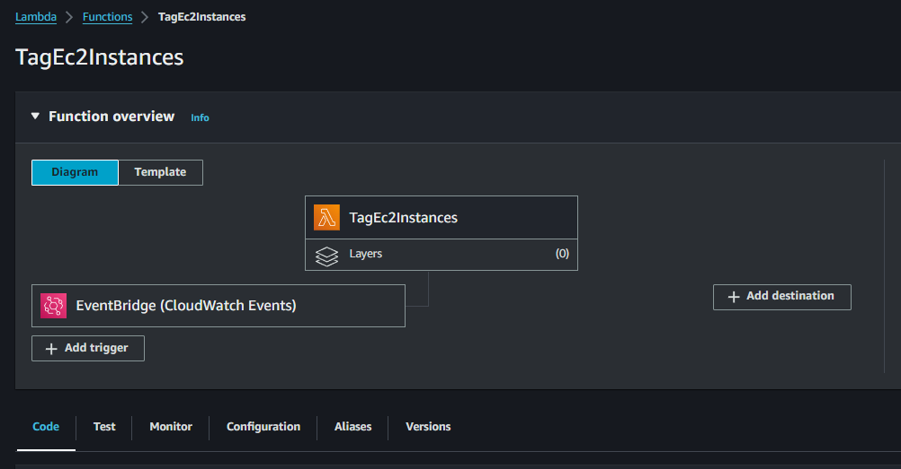
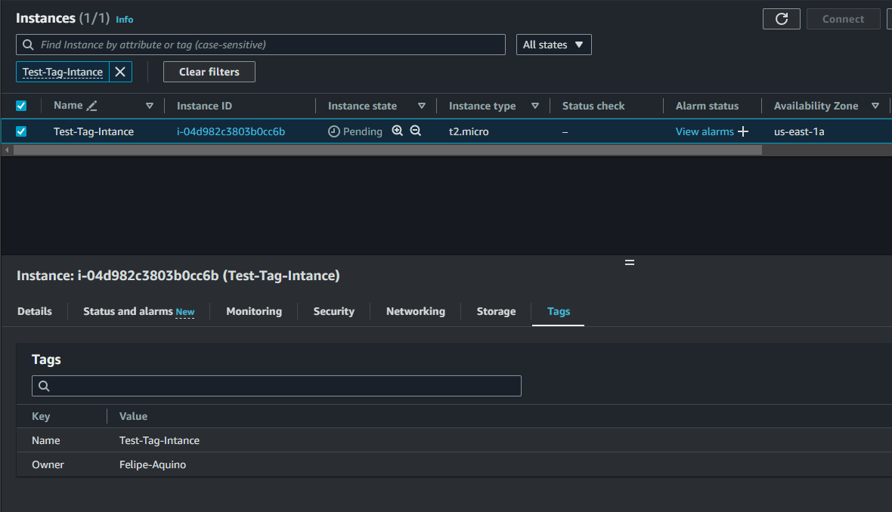

# AWS EC2 Instance Automation with Lambda Function

This project aims to automate the tagging of EC2 instances on AWS. When an EC2 instance is launched, an automation process is triggered to add tags to the instance indicating the owner's name.

## Stack Components

### 1. AWS Services
- **AWS Lambda:** Serverless compute service to run the Python code for tagging EC2 instances.
- **Amazon EC2:** Virtual servers running in the cloud.
- **Amazon CloudTrail:** Service for logging API calls made on the AWS platform.
- **Amazon EventBridge:** Service for routing events to different AWS services.
- **Amazon CloudWatch Logs:** Service for monitoring, storing, and accessing log files.
- **AWS IAM:** Identity and Access Management service to manage user permissions.

## Steps to Implement

### 1. Create Lambda Function
- Create a Lambda function named `TagEc2Instances`.
- Configure appropriate permissions for the Lambda function to access EC2 resources.


### 2. Set Up CloudTrail
- Create a CloudTrail named `project-trail`.
- Enable CloudWatch Logs for the CloudTrail.
- Create an IAM role named `CloudTrailRuleForCloudWatch` with necessary permissions.


### 3. Configure EventBridge Rule
- Create an EventBridge rule named `ec2-launch`.
- Set the event type to AWS API Call via CloudTrail.
- Specify the operation as `RunInstances`.
- Target the Lambda function `TagEc2Instances` created earlier.


### 4. Lambda Function Code




```python
import json
import boto3

ec2 = boto3.client('ec2')

def lambda_handler(event, context):
    print(event)
    
    user = event['detail']['userIdentity']['userName']
    
    instanceId = event['detail']['responseElements']['instancesSet']['items'][0]['instanceId']
    
    ec2.create_tags(
        Resources=[
            instanceId
        ],
        Tags=[
            {
                'Key': 'Owner',
                'Value': user
            },
            {
                'Key': 'Name',
                'Value': user + '-instance'
            }
        ]
    )
    
    return
```


### 5.Test the Automation
- Create an EC2 instance on AWS.
- Check the tags associated with the launched instance to ensure the Owner tag is added with the user's name.




### Note
- This automation ensures that every EC2 instance launched is tagged with the owner's name, making it easier to track ownership and manage resources effectively.